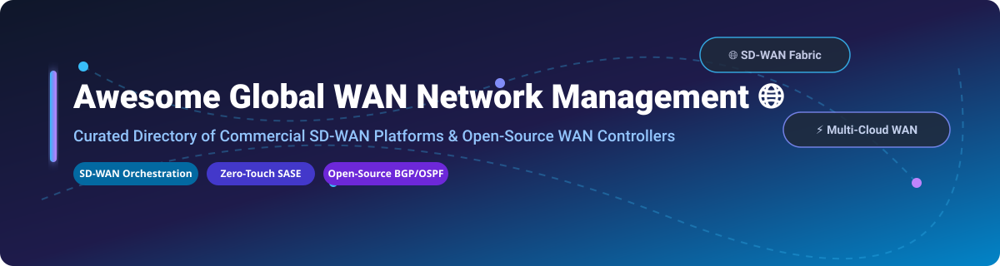

# Awesome-Global-WAN-Network-Management

# Awesome-Global-WAN-Network-Management 🌐 🛰️

  

  

  

  

  

  

  

---

## 🌟 Top Global WAN Network Management Ecosystem

**Curated List of Commercial WAN Management Platforms & Open-Source SD-WAN Tools**  

*Focused on SD-WAN Orchestration, Policy-Based Routing, Global Network Fabric, Multi-Cloud Connectivity, Zero-Touch Provisioning & Self-Hosted WAN Controllers*

**Last updated: October 2026** 📅

---

### 📌 Overview & SEO Summary

Welcome to the ultimate curated directory of **global WAN network management platforms**, **open-source SD-WAN frameworks**, and **network orchestration tools**. Whether you are looking for enterprise-grade commercial solutions (such as *Cisco SD-WAN vManage*, *Palo Alto Prisma SD-WAN*, and *Cato Networks*), or self-hostable open-source alternatives (like *OpenWISP*, *flexiWAN*, and *FRRouting*), this list covers category leaders, policy-based routing, and privacy-respecting WAN management.

**Key Market Context:**

- **Cisco SD-WAN vManage** is the **enterprise standard for SD-WAN management**, providing a single pane of glass for thousands of sites with **application-aware routing and zero-touch provisioning**.

- **flexiWAN** is the **first open-source SD-WAN**, offering **multi-tenant management with IPsec over VxLAN tunnels** on any x86 white box — **eliminating vendor lock-in**.

- **OpenWISP** provides **centralized configuration management for OpenWrt devices**, with **automated provisioning, VPN management, and network topology visualization**.

---

## 📑 Table of Contents

- [🏢 SaaS & Commercial Platforms](#-saas--commercial-platforms)

- [🔓 Open-Source GitHub Projects](#-open-source-github-projects)

- [🛠️ How to Contribute](#%EF%B8%8F-how-to-contribute)

- [📊 Star History](#-star-history)

- [🤝 Support & Sponsorship](#-support--sponsorship)

- [⚠️ Disclaimer](#%EF%B8%8F-disclaimer)

---

## 🏢 SaaS / Commercial Platforms

The global WAN network management market spans **hyperscaler-native WAN services** (AWS Network Manager, Azure Virtual WAN Manager, Google NCC) that provide **managed global network fabric with policy-driven connectivity**, **enterprise SD-WAN platforms** (Cisco vManage, VMware Orchestrator, Palo Alto Prisma) that offer **centralized orchestration for thousands of sites**, and **SASE convergence platforms** (Cato, Versa, Aryaka) that combine **networking and security in a single cloud-native platform**. **AWS Network Manager for Cloud WAN** uses **pay-as-you-go pricing** for **core network edges and data processing** . **Cisco SD-WAN vManage** uses **custom enterprise licensing** . **Cato Networks** starts at **$1.00/year** (per SoftwareAdvice) . **Aryaka** starts at **$150/site/month**.

| SaaS / Commercial Platform | Company / Owner | Valuation / Market Cap | Standard Edition Starting Price | Free Tier / Free Trial Limits | Description |

| :--- | :--- | :--- | :--- | :--- | :--- |

| **[AWS Network Manager for Cloud WAN](https://aws.amazon.com/cloud-wan/)** ☁️ | Amazon | ~$2.0 Trillion | **Pay-per-use** (core network edge attachments + data processing) | **No upfront costs**; pay-as-you-go | **AWS-native global WAN management** — **Centralized policy document (CNP)** defines segments, Regions, and attachments . **Full-mesh peering** between core network edges for high resilience . **Segments act as dedicated routing domains for isolation** . |

| **[Azure Virtual WAN Manager](https://azure.microsoft.com/en-us/products/virtual-wan/)** 🔷 | Microsoft | ~$3.90 Trillion | **Standard Hub: ¥2.544/hour** + **¥0.2034/GB** | **Free tier: limited** | **Azure-native global WAN** — **Hub-and-spoke with full-mesh hubs** in Standard tier . **Any-to-any connectivity** across branches, VNets, and ExpressRoute . **Azure Firewall Manager** for centralized security . |

| **[Google Cloud Network Connectivity Center](https://cloud.google.com/network-connectivity-center)** 🌐 | Google (Alphabet) | ~$2.0 Trillion | **Pay-per-use** (spokes + data processing) | **$300 free credits** | **GCP-native transit hub** — **Hub-and-spoke orchestration** with VPC, hybrid, and gateway spokes . **Site-to-site data transfer** using Google's global network as WAN . **NCC Gateway** for third-party SSE inspection . |

| **[Cisco SD-WAN vManage](https://www.cisco.com/)** 🔵 | Cisco | ~$200 Billion | **Custom enterprise licensing** | **Demo available** | **Enterprise SD-WAN management** — **Single pane of glass** for thousands of sites . **Application-aware routing and zero-touch provisioning** . **Cloud OnRamp for Multicloud** . **The enterprise standard for SD-WAN** . |

| **[Cato Networks Cloud](https://www.catonetworks.com/)** 🛡️ | Cato Networks | Private | **$1.00/year** (starting, per SoftwareAdvice) | **Free trial available** | **Converged SASE platform** — **Single cloud-native platform for SD-WAN and security** . **Easy to deploy and stable** with global PoPs . |

| **[Aryaka SmartServices](https://www.aryaka.com/)** ⚡ | Aryaka | Private | **$150/site/month** (SD-WAN/SASE managed service) | **Demo available** | **Managed SD-WAN/SASE** — **Global private backbone** for application acceleration . **Fully managed service** with lifecycle support . **Made affordable for SMBs** . |

| **[VMware SD-WAN Orchestrator](https://www.vmware.com/)** 🏢 | Broadcom (VMware) | ~$60 Billion | **Custom enterprise pricing** | **Demo available** | **Cloud-delivered SD-WAN** — **Dynamic Multi-Path Optimization (DMPO)** for reliable transmission over Internet . **Multi-tenant gateways** for service providers . |

| **[Palo Alto Prisma SD-WAN](https://www.paloaltonetworks.com/sase/sd-wan)** 🔴 | Palo Alto Networks | ~$60 Billion | **Base subscription per ION device** + security add-ons | **Demo available** | **SASE-integrated SD-WAN** — **ION hardware/software** for branch and data center . **Flexible licensing** with SD-WAN or SD-WAN + Branch Security . |

| **[Fortinet Secure SD-WAN](https://www.fortinet.com/)** 🟢 | Fortinet | ~$60 Billion | **Custom per-appliance licensing** | **Demo available** | **Security-first SD-WAN** — **Integrated NGFW, ZTNA, and SD-WAN** in a single appliance . **SD-WAN Service Bundle** licensing for branch and hub devices . |

| **[Versa Titan](https://versa-networks.com/)** 🟣 | Versa Networks | Private | **Consumption-based** (pay-as-you-go per tenant) | **Demo available** | **Sovereign SASE platform** — **Deployed on customer's own infrastructure** for data sovereignty . **Success-based pricing** with minimal upfront investment . |

---

## 🔓 Open-Source GitHub Projects

*Sorted by GitHub_Stars_Count (Descending)* 🌟

- **[OpenWISP](https://github.com/openwisp/openwisp-controller)**   

  **Modular and programmable open-source network management system for OpenWrt**, GPL-3.0 licensed. **Controller: 777 stars; Radius: 445 stars; netjsonconfig: 388 stars** . **Centralized configuration management, automated provisioning, X.509 PKI, management VPN (OpenVPN, WireGuard, ZeroTier)** . **Ecosystem: monitoring, firmware upgrader, network topology, IPAM, notifications, and RADIUS** . **Designed for OpenWrt but extensible to other systems** . **The most complete open-source WAN management platform** . 🌐

- **[flexiWAN](https://github.com/flexiwan/agent)**   

  **The world's first open-source SD-WAN**, open-source. **Multi-tenant management, zero-touch provisioning, IPsec over VxLAN tunnels, internet breakout** . **Eliminates vendor lock-in** by allowing interoperability with third-party applications . **Runs on any x86-based white box** . **Source code available for flexiManager and flexiEdge** . **The definitive open-source SD-WAN platform** . 🚀

- **[FRRouting (FRR)](https://github.com/FRRouting/frr)**   

  **The most widely deployed open-source routing stack**, GPL-2.0 licensed. **The de facto standard for open-source BGP** — **used by Cumulus Linux, SONiC, and major cloud providers** . **Supports BGP, OSPF, IS-IS, RIP, EIGRP, and PIM** . **Essential for building SD-WAN routing infrastructure** . **The foundation of open-source WAN routing** . 🛣️

- **[SONiC](https://github.com/sonic-net/SONiC)**   

  **Open-source network operating system for cloud and enterprise**, Apache-2.0 licensed. **The most widely deployed open-source NOS** — **used by Microsoft, Alibaba, and major cloud providers** . **FRRouting-based routing stack** with **BGP for WAN routing** . **The foundation for cost-effective WAN hardware** . 🌐

- **[VyOS](https://github.com/vyos/vyos-build)**   

  **Open-source network operating system with advanced routing**, GPL-2.0 licensed. **BGP and OSPF routing protocols** . **VPN, firewall, and high availability** support . **Cost efficiency** — no licensing fees . **The most complete open-source routing platform for WAN** . ⚙️

- **[BIRD](https://github.com/BIRD/bird)**   

  **The BIRD Internet Routing Daemon**, GPL-2.0 licensed. **The most widely used open-source BGP daemon** — **used by network operators worldwide** . **Lightweight and efficient** . **Supports BGP, OSPF, RIP, and Babel** . **The standard for WAN BGP route exchange** . 🐦

- **[Open vSwitch](https://github.com/openvswitch/ovs)**   

  **Production quality, multilayer virtual switch**, Apache-2.0 licensed. **The standard virtual switch for cloud networking** . **Used by OpenStack, Kubernetes, and major cloud providers** . **The foundation for virtual WAN networking** . 🔀

- **[Batfish](https://github.com/batfish/batfish)**   

  **Network configuration analysis and validation**, Apache-2.0 licensed. **Analyzes network configurations for correctness** . **Validates BGP routing policies** . **The standard for WAN network configuration testing** . 🐟

- **[kube-vip](https://github.com/kube-vip/kube-vip)**   

  **Virtual IP and load balancer for Kubernetes**, Apache-2.0 licensed. **Provides L2 and BGP-based VIP management** for control plane and services . **Anycast VIP for Kubernetes clusters** . ☸️

- **[Terraform Provider for Megaport](https://github.com/megaport/terraform-provider-megaport)**   

  **Terraform provider for Megaport**, MPL-2.0 licensed. **Infrastructure-as-code for interconnect provisioning** . **Automate WAN traffic steering** . **The standard for automating software-defined interconnects** . 🔧

- **[Terraform Provider for Equinix](https://github.com/equinix/terraform-provider-equinix)**   

  **Terraform provider for Equinix**, MPL-2.0 licensed. **Infrastructure-as-code for Equinix Fabric** . **Automate WAN virtual connections** . **The standard for automating Equinix interconnects** . 🔗

- **[OpenWrt](https://github.com/openwrt/openwrt)**   

  **Open-source router firmware**, GPL-2.0 licensed. **The most widely deployed open-source router OS** . **The foundation for OpenWISP and open-source WAN edge devices** . 📡

---

## 🛠️ How to Contribute

Contributions are welcome! Follow these steps to submit new WAN management platforms or open-source SD-WAN software:

1. 🍴 **Fork** the repository.

2. 📝 **Add/edit** entries in `README.md` maintaining table/list structure and formatting.

3. 🔗 Include project title, official website/GitHub link, exact Stars_Count, license, and brief description.

4. 🚀 Submit a **Pull Request** with a descriptive summary of your changes.

---

## 📊 Star History

---

## 🤝 Support & Sponsorship

If you find this global WAN network management repository useful, please consider supporting the project:

- ⭐ **Star** this repository to increase visibility!

- 🔀 **Fork** and share with fellow network engineers, cloud architects, and open-source advocates.

- ☕ **Sponsor & Buy Me a Coffee**: Support ongoing open-source curation via the [GitHub Sponsor Dashboard](https://github.com/sponsors/ishandutta2007).

---

## ⚠️ Disclaimer

- This is a **community-curated** list — not exhaustive and not an endorsement. ℹ️

- **Cisco SD-WAN vManage is the enterprise standard** for SD-WAN management with **single pane of glass for thousands of sites** . **flexiWAN is the first open-source SD-WAN** with **multi-tenant management and zero vendor lock-in** . **OpenWISP provides centralized configuration for OpenWrt devices** with **automated provisioning and VPN management** .

- **Pricing varies by platform**: **AWS Network Manager for Cloud WAN uses pay-per-use** , **Cato starts at $1.00/year** , **Aryaka at $150/site/month** .

- **Open-source WAN management tools are not turnkey** — **flexiWAN requires x86 white box hardware** . **OpenWISP requires OpenWrt devices and server infrastructure** . **FRR and BIRD require network engineering expertise** . **Always validate routing convergence and failover with a proof-of-concept** before production deployment . 🌐

---

  <b>Made with ❤️ for network engineers, cloud architects, and open-source WAN management advocates.</b>

